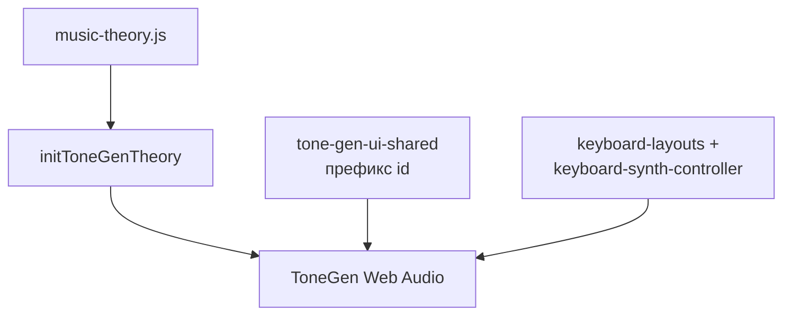

# Структура синтезатора (генератор тона)

Документ описывает **слои** и связи модулей для страниц с `ToneGen` и общим чтением полей по **префиксу id** (`ntg-`, `cts-ntg-`, `tpl-`). Доменная теория (темпация, ноты, обертоны как акустический ряд) — в [music-theory.md](music-theory.md), здесь только архитектура кода.

## Слой данных

- [`lib/music-theory.js`](../lib/music-theory.js) — расчёт частот, в т.ч. `frequencyFromNoteNameOctave`; опорная частота **A4** задаётся в UI и передаётся в движок.
- Инициализация ссылок на теорию: `initToneGenTheory()` в [`app/tone-gen-engine.mjs`](../app/tone-gen-engine.mjs), вызывается из страниц после динамического `import('../lib/music-theory.js')` (чтобы при `file://` можно показать предупреждение).

## Слой движка

- Класс **`ToneGen`** в [`app/tone-gen-engine.mjs`](../app/tone-gen-engine.mjs): `AudioContext`, моно / полифония, режимы **`hold`** | **`latch`** | **`latchPoly`** в поле **`mode`**, плавное угасание `releaseSmoothSec`, громкость выхода, поля голоса, совместимые с `buildPlayPayload` (форма колебания, детун, смесь и спад обертонов, включённые частичные тоны n=1…16). Опционально **`keyboardMode`** (`null` по умолчанию): на [`app/circle-scales.html`](../app/circle-scales.html) задаётся отдельно от **`mode`** (круг против клавиатуры); [`app/keyboard-synth-controller.mjs`](../app/keyboard-synth-controller.mjs) для клавиш использует `keyboardMode ?? mode`. Для клавиатуры круга допустимо **`holdPoly`**: полифония с **удержанием** — `startPolyVoice` на нажатие (pointer или ПК), `stopPolyVoiceSmooth` на отпускание; голоса без префикса `cts:` не пересекаются с триадами круга (см. комментарий в [`app/circle-scales.mjs`](../app/circle-scales.mjs) про `syncChordAudioAndList`). Режим **`latchPoly`** — по-прежнему переключатель голоса по клику/нажатию, без автоматического глушения при отпускании клавиши. На странице круга общая кнопка **STOP** поверх страницы останавливает круг и клавиатуры и переводит `mode` и `keyboardMode` обратно в **удержание**. Ограничение одновременных клавиш ПК обычно задаётся **аппаратным rollover** (часто до ~6 произвольных клавиш; дешёвые матрицы могут «терять» часть аккордов), а не лимитом Web Audio.

## Слой привязки UI

[`app/tone-gen-ui-shared.mjs`](../app/tone-gen-ui-shared.mjs) — единый контракт по **суффиксам id** после префикса: `readToneGenParams(prefix)`, `buildPlayPayload(prefix, name, octave)`, `readOctaveRange(prefix)`, `buildBaseParams(prefix)`.

Таблица полей: `a4`, `octave-min` / `octave-max`, `volume`, `waveform`, `detune`, `harm-mix`, `harm-rolloff`, контейнер `harmonics` (чекбоксы частичных тонов), `release-ms`.
Мобильная fullscreen-страница [`app/seventh-chords-mobile.html`](../app/seventh-chords-mobile.html) использует тот же контракт с префиксом **`sc7m-ntg-`**, но выводит только компактные контролы **громкость / угасание / смесь обертонов / детюн**; `a4`, `waveform`, `octave-min` / `octave-max`, `harm-rolloff` и чекбоксы `harmonics` остаются скрытыми дефолтами для `readToneGenParams`.

## Слой клавиатуры

- [`app/keyboard-layouts.mjs`](../app/keyboard-layouts.mjs) — `buildLinearKeys` и разметка кнопок.
- [`app/keyboard-synth-controller.mjs`](../app/keyboard-synth-controller.mjs) — указатель, подсветка воспроизведения, глобальные `keydown` / `keyup` для физической клавиатуры (`bindComputerKeyboard`). В режиме **удержание** (`hold`) класс **`ntg-key-down`** показывает последнее нажатие в рамках моно: перед новым нажатием он снимается со всех клавиш в области подсветки / у указателя; остановка звука по отпусканию мыши или клавиши ПК выполняется только если отпущенная нота совпадает с текущим моно-голосом (`latchedKey`), чтобы при смене ноты с другого ввода не обрывался уже звучащий тон.
- [`app/computer-keyboard-music.mjs`](../app/computer-keyboard-music.mjs) — раскладка по `event.code` (US QWERTY): для **linear** — на экране одна сетка на октаву (порядок имён совпадает с `buildLinearKeys`: по умолчанию диезный ряд **`NOTE_NAMES`** в [`app/tone-gen-engine.mjs`](../app/tone-gen-engine.mjs), согласованный с **`CHROMATIC_NAMES_SHARP_BY_PC`**; на страницах с ладом/тональностью передаётся **`namesByPc`**); `linearComputerCodesForOctaveRange(octave-min, octave-max)` сопоставляет **каждую октаву в диапазоне одному физическому ряду** клавиатуры слева направо: 1-я октава — `1234567890-=`, 2-я — `qwertyuiop[]`, 3-я — `asdfghjkl;'` и `Backslash` (12-я клавиша ряда), 4-я — `zxcvbnm,./` плюс `Backquote` и `Space` до 12 нот; пятая и далее — по 12 неиспользованных кодов из `SEQUENTIAL_ROW_CODES`, затем запасной список. Первая клавиша каждого такого ряда — начало октавы на экране (первая кнопка ряда, до / C). i-й код → i-я кнопка в порядке DOM. Для **bayiano** — `createBayanCodeMap(midi-min, midi-max)` по границам **номера ноты MIDI** из полей октав: три ряда ПК снизу вверх — **`KeyA`**…`Quote` (1-й ряд баян), **`KeyW`**…`Backslash` (2-й), **`Digit3`**…`Equal` (3-й); первая клавиша каждого ряда ПК — к **наименьшей** колонке `chromaticColumnFromMidi` среди нот диапазона в этом ряду (при **octave-min** = 3 и полном охвате октавы 3 — **C3 / C#3 / D3** в рядах 1-й…3-й); соответствие рядам (баян) **1-й → 2-й → 3-й** (см. [domain.md](domain.md)); внутри ряда — слева направо по возрастанию колонки; ряд `zxcv…` не задействован; если в ряду баяна кнопок больше, чем клавиш в ряду ПК, лишние **справа** по колонке остаются без клавиш (игра мышью). Для **bayiano4** — `createBayanCodeMap(midi-min, midi-max, { rowCount: 4 })`: четыре ряда ПК сверху вниз — `Digit4`…`Equal`, `KeyE`…`Backslash`, `KeyS`…`Quote`, `KeyZ`…`Slash` ↔ ряды (баян) **4-й…1-й**; при **octave-min** = 3 и охвате октавы 3 — стартовые ноты **Eb3 / D3 / C#3 / C3** сверху вниз (4-й…1-й ряд); порядок внутри ряда по `chromaticColumnFromMidi(m, 4)`; усечение **справа**, как у **bayiano**. На странице круга карта передаётся в `bindComputerKeyboard` как `getBayanCodeMap` (содержимое зависит от вида **bayiano** / **bayiano4**). Без колбэка — запасной путь `SEQUENTIAL_ROW_CODES` и порядок DOM. Для **piano** — четыре физических ряда сверху вниз (цифры → Q…\\ → ASDF…' → Z…/): верхний и третий ряды — чёрные клавиши (классы высоты с диезом и «немые» позиции между ми–фа и си–до), второй и нижний — последовательные натуральные ноты от **C** в опорной **октаве** у `KeyQ` (`octave-min`); один код → одна высота; кламп по диапазону **номера ноты MIDI** из полей октав. Ввод не перехватывается при фокусе в `input`, `textarea`, `select`, `[contenteditable]`.

На [`app/seventh-chords-mobile.html`](../app/seventh-chords-mobile.html) UI «Голоса» / «Артикуляция» не выводится: движок стартует с `ToneGen.mode = 'latchPoly'` и `keyboardMode = 'holdPoly'`, то есть экранная клавиатура и ПК играют в режиме полифонического удержания.

## Темплейт-синт (другой UI к тем же API)

Страница [`app/template-synth.html`](../app/template-synth.html) + [`app/template-synth.mjs`](../app/template-synth.mjs), префикс **`tpl-`**. Визуальный слой — блоки из [`app/synth-kit/`](../app/synth-kit/) (крутилка, фейдер, матрица чекбоксов); **источник истины для движка** — те же значения в скрытых/синхронизированных полях с id `tpl-*`, что ожидает `readToneGenParams`.

**Намеренные исключения** из «только kit»:

- **Форма колебания** — компактный `<select id="tpl-waveform">` (в kit нет отдельного виджета-списка).
- **Камертон и границы октав** — компактные `<input type="number">` в том же корне `synth-kit-root`.

Переключение **удержание** / **фиксация** / **фиксация полифония** на темплейт-синте не дублируется: это относится к клавиатуре и остаётся на [`app/note-tone-gen.html`](../app/note-tone-gen.html). Здесь движок работает в режиме **`hold`** (как значение по умолчанию в `ToneGen`).

Подробнее про kit — [synth-ui.md](synth-ui.md).

## Схема потока

